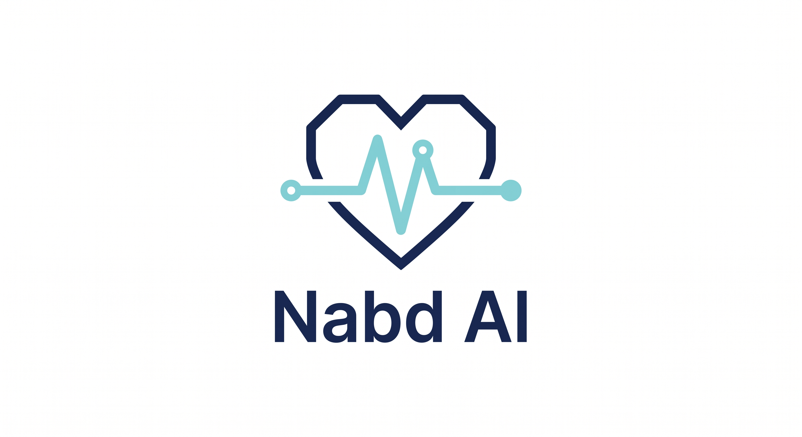

# Nabd AI

<p align="center">
  
</p>

<p align="center">
  <b>Privacy-first localized medical AI for Egyptian hospitals</b><br/>
  From patient complaints to safe clinical action.
</p>

---

## Overview

**Nabd AI** is a hospital-ready medical AI system designed for the Egyptian healthcare context.  
It helps transform **colloquial Egyptian Arabic patient complaints** into **safe, grounded, and actionable clinical support** while keeping sensitive patient information inside hospital infrastructure.

The project combines:

- **Medical Guardrails** for safety and routing
- **Egyptian Arabic → Medical English / MeSH Mapping**
- **Grounded Medical RAG**
- **Local LLM inference**
- **Multi-agent hospital workflows**

---

## Problem Statement

Hospitals need trusted medical AI — not another generic chatbot.

Current medical AI systems often face major challenges:

- Patient data may be exposed through cloud-based AI systems
- Egyptian patients speak in **colloquial Egyptian Arabic**, while medical systems rely on **clinical English terminology**
- Open chatbots can be vulnerable to **prompt injection**, **abusive input**, and **unsafe emergency handling**
- Traditional RAG systems retrieve weak evidence when patient complaints are not medically rewritten first
- Most chatbots stop at answering and do not support real hospital workflows such as **doctor recommendation**, **EHR context**, or **appointment booking**

---

## Solution

**Nabd AI** addresses these challenges through a multi-layer architecture:

1. **Patient Input Layer**
   - Accepts text or voice input
   - Handles colloquial Egyptian Arabic

2. **Guardrail Layer**
   - Detects safety categories such as:
     - Emergency
     - Injection
     - Abuse
     - Illogical medical input
     - Valid medical input
     - General chat

3. **Medical Mapping Layer**
   - Converts Egyptian Arabic complaints into:
     - Clinical notes
     - Medical English queries
     - MeSH concepts
     - Suggested specialties

4. **Medical RAG Layer**
   - Retrieves grounded evidence from:
     - **Harrison’s Principles of Internal Medicine**
     - **DDXPlus**
   - Uses hybrid retrieval with vector databases such as **FAISS / Qdrant**

5. **Local LLM Layer**
   - Generates safer responses through grounded context
   - Supports privacy-first local deployment

6. **Multi-Agent Hospital Workflow**
   - Doctor recommendation
   - Patient history / EHR context
   - Scheduling
   - Appointment booking

---

## Key Features

- Privacy-first / Zero-Egress design
- Egyptian Arabic medical understanding
- Guardrail before LLM/RAG
- MeSH-based medical query mapping
- Grounded medical RAG
- Local inference for hospital environments
- Multi-agent workflow automation
- Hospital-ready architecture

---

## Tech Stack

### AI / ML
- mmBERT
- ONNX Runtime
- Medical-mT5
- LoRA / PEFT
- Gemma / Local LLM
- Hugging Face

### Backend
- FastAPI
- Pydantic
- Agent orchestration
- Tool calling

### RAG / Retrieval
- FAISS / Qdrant
- Hybrid retrieval
- Semantic chunking
- Embeddings

### Data Sources
- Harrison’s Principles of Internal Medicine
- DDXPlus
- Altibbi / WebTeb-derived processed consultation samples

### Evaluation
- RAGAS
- Faithfulness
- Answer Relevancy
- Recall / F1 for safety tasks

---

## System Workflow

Patient Complaint → Guardrail Safety Check → Clinical Mapping → Medical Evidence Retrieval → Local AI Response → Doctor Recommendation → Appointment Booking

---

## Repository Structure

```bash
nabd-ai/
│
├── assets/                 # logo, diagrams, images
├── data/                   # datasets or processed samples
├── docs/                   # reports, proposal, presentation
├── notebooks/              # experiments and exploration
├── src/                    # source code
│   ├── guardrail/
│   ├── mapping/
│   ├── rag/
│   ├── agents/
│   ├── api/
│   └── utils/
├── tests/                  # tests
├── requirements.txt
├── README.md
└── LICENSE
